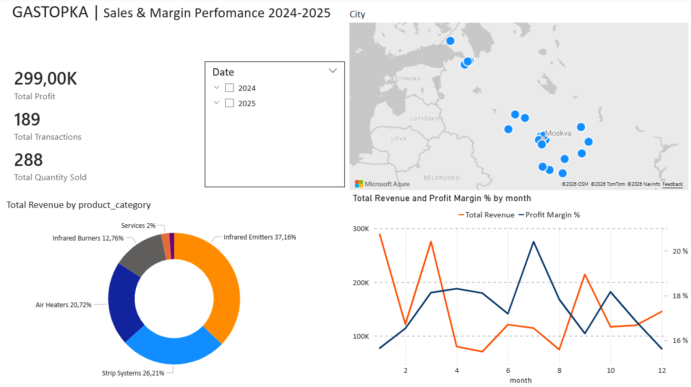
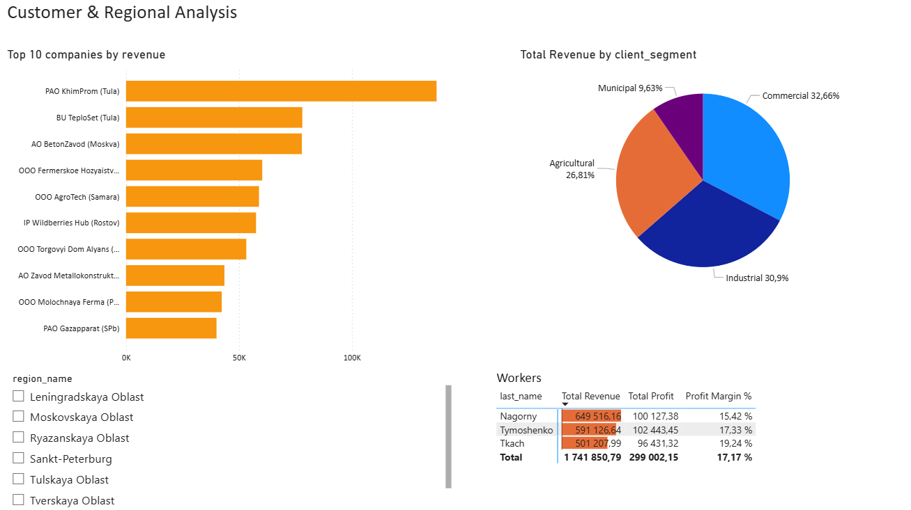

# 🔥 Gastopka Analytics: Optimizing Sales & Logistics for a Family Business

## 👋 About the Project
This is a real-world analytics project I built for my family's business, **Gastopka** (a supplier of industrial heating equipment).

Before this project, all data was messy and scattered across **1C (ERP system)** and multiple **Excel** files. We had no clear picture of our sales performance or inventory status.

**My Goal:** To clean the data, build a centralized database, and create a dashboard to help my father make a key decision: **"Do we need to rent a second warehouse in the South?"**

---

## 🛑 The Problems (Before)
1.  **Messy Data:** Exports from 1C and Excel had different formats, "dirty" dates, and duplicates.
2.  **Logistics Bottleneck:** We have only one warehouse in **Khimki (North)**. Shipping to Southern clients takes too long.
3.  **Dead Stock:** We didn't know which products were just gathering dust in the warehouse and freezing money.

---

## 🛠️ How I Solved It (Technical Workflow)

### 1. Data Cleaning & Transformation (Power Query & Python)
* **Power Query:** Used as the first layer of cleaning to standardize mixed date formats (text/timestamp) and filter raw data from 1C exports.
* **Python Automation (Anaconda):** Generated and executed a Python script via **Anaconda** to create the `D_DATE` dimension table. I chose this approach to automate the routine work, which significantly **simplified the workflow and sped up** the data preparation process.
* **Structure Preparation:** Standardized column names and types across all CSV files before loading them into the database.

### 2. Data Modeling & Storage (PostgreSQL)
* **Star Schema Design:** Implemented a Constellation Model (Star Schema with shared dimensions) to optimize query performance.
* **Data Warehousing:** Imported the cleaned data into **PostgreSQL**.
* **Validation via SQL:** Executed key SQL queries to verify inventory accuracy and regional distribution before connecting the BI tool.

### 3. Visualization (Power BI)
* **Data Modeling:** Established relationships between Fact and Dimension tables.
* **DAX & UI:** Developed complex measures (YoY Growth, Profit Margin) and designed an interactive, user-friendly dashboard.

---

## 📊 Key Insights & Results

### 1. The Warehouse Question
* **Result:** The "Customer Analysis" dashboard showed that we have growing demand in the South.
* **Decision:** The data supports the idea of opening a small transit hub in the South to speed up delivery.

### 2. Product Matrix (BCG)
* **Result:** I built a Scatter Plot (Revenue vs. Margin). We found popular products that actually have **very low profit**.
* **Decision:** Focus sales managers on selling high-margin equipment instead of just chasing volume.

---

## 📷 Dashboard Screenshots

### Executive Overview

### Product Matrix

### Regional Analysis

---
*Note: Client names and specific financial figures have been anonymized for privacy.*
